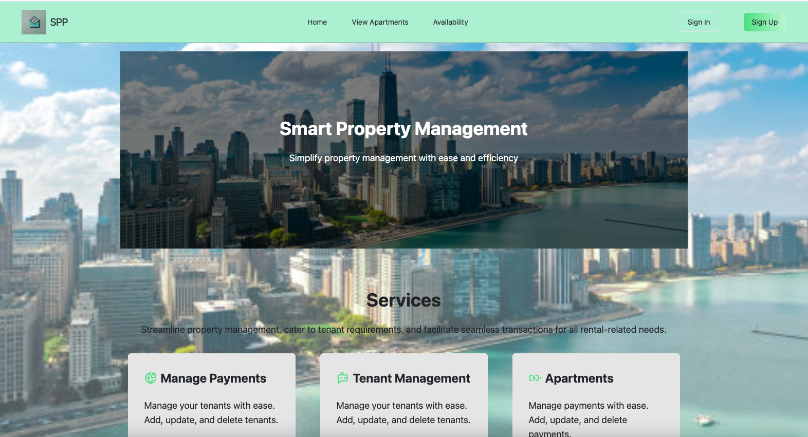

# 🏢 Property Management Website

[Visit the Website](https://property-management-website.onrender.com)

## 📋 Project Description

Implemented a full-stack Flask-React application for managing properties for owners and tenants.

- **Integrated Technologies**: 
  - **Backend**: Flask
  - **Frontend**: JavaScript-React
  - **Payments**: Stripe
  - **Database**: PostgreSQL

## 🚀 Features

### Phase I
- Tenants can sign up, sign in, view available units, make payments, and request more information via email.

### Phase II (Current Work in Progress)
- Developing an owner (admin) dashboard displaying all units, tenant data for each unit, rent payment status, and more.
- Integrating Google API for streamlined sign-in functionality.

## 🖼️ Project Screenshot

